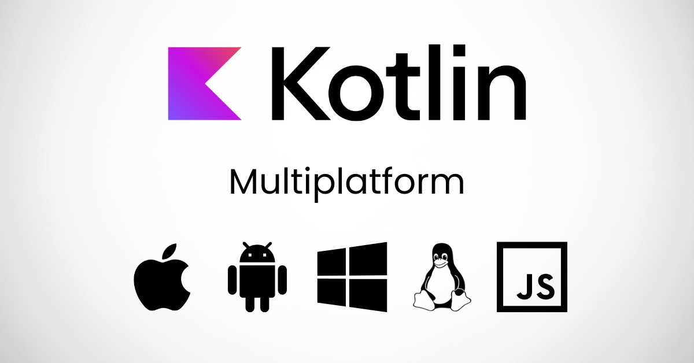
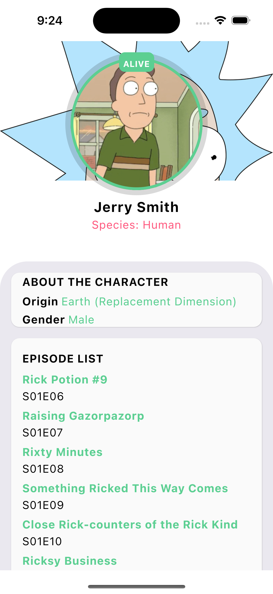
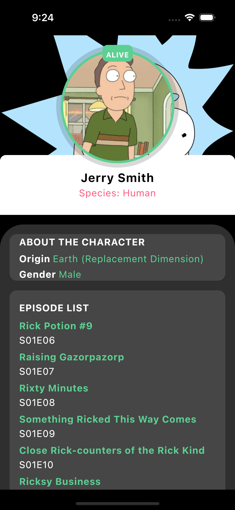
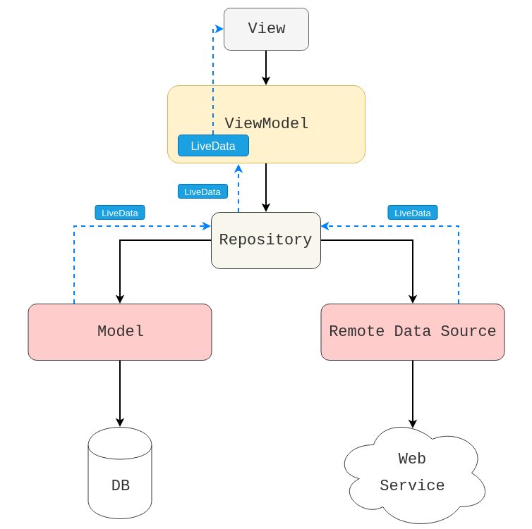
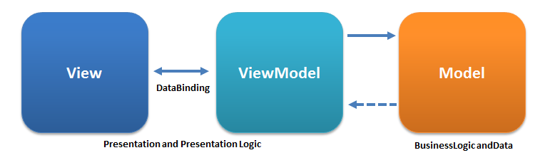

  

This is a Kotlin Multiplatform project targeting Android, iOS.

* `/composeApp` is for code that will be shared across your Compose Multiplatform applications.
  It contains several subfolders:
  - `commonMain` is for code that’s common for all targets.
  - Other folders are for Kotlin code that will be compiled for only the platform indicated in the folder name.
    For example, if you want to use Apple’s CoreCrypto for the iOS part of your Kotlin app,
    `iosMain` would be the right folder for such calls.

* `/iosApp` contains iOS applications. Even if you’re sharing your UI with Compose Multiplatform, 
  you need this entry point for your iOS app. This is also where you should add SwiftUI code for your project.

## 📷 Previews

   

## 🛠 Tech Stack & Open Source Libraries
- Minimum SDK level 21.
- 100% [Jetpack Compose](https://developer.android.com/jetpack/compose) based + [Coroutines](https://github.com/Kotlin/kotlinx.coroutines)
- Jetpack
 - Compose: Android’s modern toolkit for building native UI.
 - ViewModel: UI related data holder and lifecycle aware.
 - App Startup: Provides a straightforward, performant way to initialize components at application startup.
 - Paging: For navigating screens and [Paging KMP](https://github.com/cashapp/multiplatform-paging) 
 - Room: Constructs Database by providing an abstraction layer over SQLite to allow fluent database access.
- [Ktor](https://github.com/skydoves/landscapist#glide): HTTP client
- [Koin](https://github.com/square/retrofit): Dependency Injection.
- [ksp](https://github.com/google/ksp): Kotlin Symbol Processing API.
- [viewmodel-lifecycle](https://github.com/skydoves/viewmodel-lifecycle): ViewModel Lifecycle allows you to track and observe Jetpack's ViewModel lifecycle changes.

## 🏛️ Architecture

[Google's official architecture guidance](https://developer.android.com/topic/architecture).

*This App* was built with [Guide to app architecture](https://developer.android.com/topic/architecture), so it would be a great sample to show how the architecture works in real-world projects. 

### UI Layer

The UI Layer consists of UI elements like buttons, menus, tabs that could interact with users and [ViewModel](https://www.jetbrains.com/help/kotlin-multiplatform-dev/compose-viewmodel.html) that holds app states and restores data when configuration changes.

Learn more about [Kotlin Multiplatform](https://www.jetbrains.com/help/kotlin-multiplatform-dev/get-started.html)…

